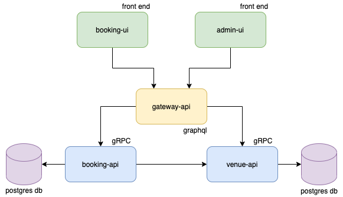

# table booking platform monorepo


## architecture



## development environment

### apis

#### venue api

used to manage venue information on the booking platform

1. Go to the `venue_api` lib directory.
1. populate `.env` file from example
1. ensure lib folder contains certs (see below)
1. run `make dev` to run api and postgres instance in docker-compose

#### booking api

used to manage bookings on the platform

1. Go to the `booking_api` lib directory.
1. populate `.env` file from example
1. ensure lib folder contains certs (see below)
1. run command `make postgres` to create an instance of the booking database in docker-compose
1. run command `cargo run` to start api locally

#### gateway api

graphql api used to receive requests from clients and forward them to gRPC apis

1. Go to the `gateway_api` lib directory.
1. populate `.env` file from example
1. ensure lib folder contains certs (see below)
1. run command `make local` to start api locally


##### certificate generation

APIs need a public and private key to communicate with each other. 
Run the following command to generate certificates. Place them in the individual API folders.

```shell
openssl req -x509 -out localhost.crt -keyout localhost.key \
  -newkey rsa:4096 -nodes -sha256 \
  -subj '/CN=localhost' -extensions EXT -config <( \
   printf "[dn]\nCN=localhost\n[req]\ndistinguished_name = dn\n[EXT]\nsubjectAltName=DNS:localhost\nkeyUsage=digitalSignature\nextendedKeyUsage=serverAuth")
```

### user interfaces

#### booking ui

a front end client that allows users to make bookings

1. Go to the `booking_ui` lib directory.
1. Run `make dev` to install dependencies, generate graphql code and run user interface.

#### admin ui

a front end client that allows venue administrators to make service changes

1. Go to the `admin_ui` lib directory.
1. Run `make dev` to install dependencies, generate graphql code and run user interface.
